###

<h3 align="left">Hi 👋! My name is parkm04 and I'm a Undergraduate student, from Hanyang University</h3>

###

I'm interested in Rust Programming with ROS2

###

  

    
     
  

###

  
  
  
  
  
  
  

###

 

###
